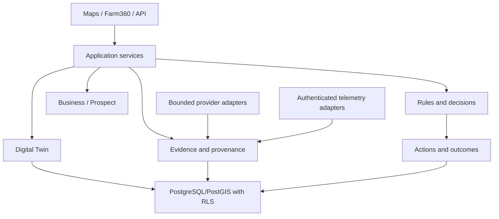
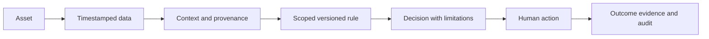
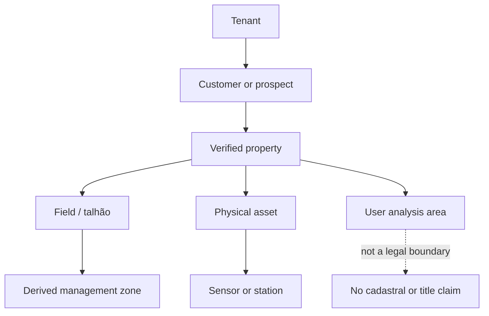
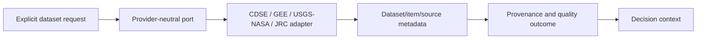
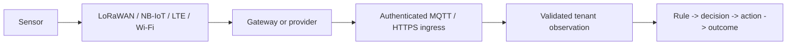
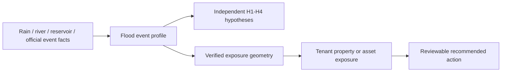
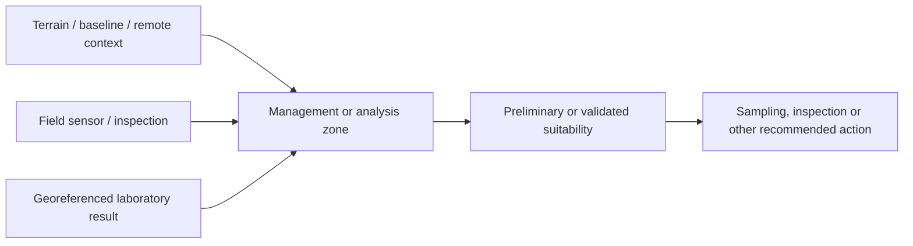
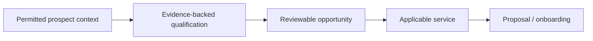

# Platform flows

These diagrams are version-controlled conceptual flows. They describe intended
boundaries; they do not assert that every planned adapter, UI or automation is
implemented.

## System and module relationships

## Data and decision flow

## Digital Twin hierarchy

## Provider and telemetry flows

## Flood, soil and prospect flows

Satellite, modelled, sensor, laboratory and manual inputs retain their own
classification throughout each flow. A provider failure, a suggested sample
location or a causal hypothesis cannot be emitted as a factual conclusion.
