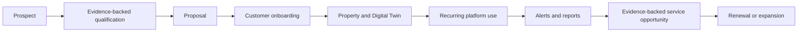

# Service packaging and customer journey

## Commercial model

**Status: HYPOTHESIS TO VALIDATE.** The leading model is hybrid:

```text
onboarding / initial study
  + recurring platform subscription
  + optional consulting, field services, hardware and third-party costs
```

It avoids treating high-touch field/laboratory/hardware work as hidden SaaS
margin. It does not establish a price, commitment, SLA or commercial offer.

## Provisional package structure

| Package | Digital value hypothesis | Boundary |
|---|---|---|
| Entry / Essential | Property map, baseline Farm360, context, basic alerts and periodic summary. | Scope/refresh/support must be validated. |
| Professional | Advanced monitoring/rules/history, Soil Intelligence, management zones and reports. | Features remain subject to implementation and expert/data gates. |
| Intelligence / Advanced | Environmental intelligence, custom rules, telemetry, API/integrations and higher support. | Requires operating capacity, security and provider validation. |
| Consulting projects | Diagnostic, onboarding, connectivity, suitability, field inspection, custom work. | One-time/hourly/fixed scope as agreed. |
| Add-ons | Sensors, drone, laboratory, field visit, custom integration or specialist study. | Separate third-party/field cost and safety scope. |

## Product/service matrix

`I` = potential included, `O` = optional, `E` = expert/field required, `—` =
not proposed. This is a design matrix, not a sell sheet.

| Feature/service | Essential | Professional | Advanced | Consulting | Add-on |
|---|---:|---:|---:|---:|---:|
| Farm360 baseline | I | I | I | O | — |
| Context/alerts/reports | I | I | I | O | — |
| Soil/suitability context | — | I | I | E | O |
| Flood/environmental study | — | O | I | E | O |
| Custom rules/API/telemetry | — | O | I | E | O |
| Sensor/lab/drone/field work | — | — | O | E | O |

## Customer segments

Potential segments are small and medium producers, large farms,
cooperatives/associations, agribusiness, municipal/public organizations,
enterprise/infrastructure and consulting partners. A cooperative model may
combine a cooperative tenant with member producers/properties while preserving
property-level isolation; it is a future hypothesis, not a privacy exception.

## Customer journey and onboarding



Onboarding is repeatable: create tenant/customer; confirm property/boundary;
register assets and sources; establish Digital Twin; activate approved modules
and rules; generate baseline report; train; go live. Human time is measured for
future cost validation. Support levels are proposed as self-service,
standard, priority and managed service; do not promise 24x7 or an SLA absent
operational capacity.
