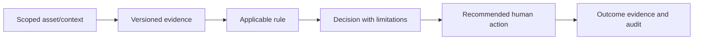

# Business rule catalogue

This is the canonical human-readable catalogue for production and proposed
rules. The executable/versioned record remains the authority for a decision;
this document never rewrites historical policy.

## Required rule metadata

Every rule has a stable ID, name/description, scope (tenant, customer,
property, field, zone, asset or crop), tenant applicability, inputs,
conditions, output/decision/recommended action, evidence requirements, source
of business/agronomic policy, expert-validation state, version, effective and
retirement dates, and test/documentation links. A rule with missing mandatory
evidence returns `UNKNOWN` or `INCONCLUSIVE`; it does not default to false.

| Rule family | Current state | Scope / constraints | Canonical detail |
|---|---|---|---|
| Versioned decision rules | `IMPLEMENTED` | `TENANT`, `PROPERTY` and explicit `ASSET`. An asset rule is considered only by `POST /v1/tenants/{tenant_id}/assets/{asset_id}/evaluate`, requires a tenant-local asset linked to the decision property, and takes precedence over that property's rule only in that request. Property evaluation never selects an asset rule. | `engine.py`, `service.py`, migration 036. |
| Action outcome closure | `IMPLEMENTED` | Tenant-authorized `OPEN` action; explicit result, classification, timestamp, optional tenant evidence and responsible actor retained. Farm360 exposes it only with `action:write`. | migration 029; `test_vertical_slice.py`, `RiskDecisionPanel.test.tsx`. |
| Commercial opportunity qualification | `IMPLEMENTED` | Valid tenant evidence required; unknown does not create opportunity. | [Business rules](../business/RIBEIRA_BUSINESS_RULES.md), `business.py`. |
| Flood exposure assessment | `FOUNDATION` | Only verified flood extent and tenant geometry can calculate exposure. | migration 030; H1–H4 are hypotheses, not causal arrows. |
| Suitability / irrigation / banana policies | `PLANNED` | Must be scoped and expert-approved where agronomic. | `EXPERT_VALIDATION_REQUIRED`; see [Agro docs](../agro/AGRICULTURAL_SUITABILITY.md). |

## Asset-scoped rule boundary

An asset registration contributes only factual applicability context. The evaluation retains its opaque `ASSET_REGISTRATION` evidence ID and `subject_asset_id` in the immutable decision, alongside the property-scoped observation evidence. If that registration evidence is unavailable, the result is `UNKNOWN`/`INCONCLUSIVE`; Ribeira does not use an unproven asset record to select a rule. The asset is never converted into a sensor reading, health state, agronomic diagnosis or automatic action.

The API requires both `asset:read` and `decision:read`; active-rule creation retains the existing `rule:create` and distinct-approver controls. PostgreSQL binds both rule and decision asset references to the same tenant, and a trigger requires the decision's asset to belong to its recorded property. Customer, field, management-zone and crop inheritance are not implied by this slice.

## Rule-to-outcome flow

## Farm360 outcome workflow

An operator with `action:write` opens an `OPEN` action in the authenticated
property workspace and records the result text, its epistemic classification and
the time it was recorded. Outcome evidence identifiers are optional because a
manual confirmation may itself be the available result, but any supplied
identifier is validated as tenant-local by the API. The browser never copies
the decision evidence into the outcome automatically: evidence that supported a
recommendation is not necessarily evidence that the action produced a result.

The API persists the original decision and recommendation unchanged, completes
the action once, records the responsible authenticated actor, and emits
`ACTION_OUTCOME_RECORDED` audit evidence. A failed submission leaves the action
open and displays no fabricated completion. Users without `action:write` can
read the persisted decision history but cannot see or invoke the completion
control.
